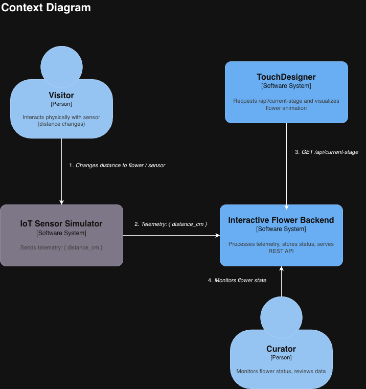

# Interactive Museum Artifact System (IMAS)

IoT-based museum artifact interaction system with Azure Functions for telemetry processing and REST API.

## Architecture

### System Overview

```
IoT Device → IoT Hub → Event Hub → FunctionTelemetry → Cosmos DB
                                                              ↓
                                                    FunctionApi (HTTP)
                                                              ↓
                                                      TouchDesigner
```

### C4 Diagrams

#### Context Diagram



High-level view of the system showing interactions between users, IoT devices, and external systems.

#### Container Diagram


Detailed view of the system's containers (Azure Functions, databases, and external services) and their interactions.

## 📁 Project Structure

```
IMAS/
├── azure/                # bicep
│   ├──main.bicep
│   ├──README.md
├── backend/              # Azure Functions
│   ├── src/
│   │   ├── functions/
│   │   │   ├── FunctionApi.js          # HTTP API
│   │   │   └── FunctionTelemetry.js    # Event Hub trigger
│   │   └── index.js
│   ├── package.json
│   └── README.md
├── simulator/            # IoT device simulator
│   └── iot-simulator.js
├── touchdesigner/        # TouchDesigner integration scripts
│   └── simple_script.py
├── public/
│   └── images/          # Architecture diagrams
└── README.md
```

## Quick Start

### Prerequisites

- **Node.js** (v14 or higher)
- **Azure Functions Core Tools** (v4.x)
- **Azure CLI**
- **VS Code Extensions**: Azure Functions & Bicep
- **Azure Account**

### Installation

1. **Clone the repository**

   ```bash
   git clone <repository-url>
   cd IMAS
   ```

2. **Provision Infrastructure (Azure Bicep)**
   Before configuring the backend, you must create the resources in Azure:

   ```bash
   az login
   az group create --name <your-resource-group> --location <location>
   az deployment group create --resource-group <your-resource-group> --template-file main.bicep
   ```

   Note: Save the values from the Outputs section of this command.

3. **Set up Backend (Azure Functions)**

   ```bash
   cd backend
   npm install
   ```

   Configure backend/local.settings.json using the values from the Bicep outputs.

   For EVENT_HUB_CONNECTION_STRING, manually retrieve the Event Hub-compatible endpoint from the Azure Portal (IoT Hub > Built-in endpoints).

4. **Deploy to Azure (Production)** To run your functions in the cloud:

   ```bash
   func azure functionapp publish <functionAppName_from_outputs>
   ```

5. **Set up IoT Simulator**

   ```bash
   cd ../simulator
   npm install
   ```

   Register your device:

   ```bash
   az iot hub device-identity create --hub-name <hub-name> --device-id <device-id>
   ```

   Get the connection string:

   ```bash
   az iot hub device-identity connection-string show --hub-name <hub-name> --device-id <device-id>
   ```

   Update iot-simulator.js with this string and run:

   ```bash
   node iot-simulator.js
   ```

## Usage

### Running the System

#### 1. Start the Azure Functions Backend

```bash
cd backend
npm start
```

The API will be available at `http://localhost:7071/api/FunctionApi`

#### 2. Run the IoT Sensor Simulator

In a new terminal:

```bash
cd simulator
node iot-simulator.js
```

The simulator will send telemetry data to Azure IoT Hub every 5 seconds.

#### 3. Connect TouchDesigner

See `touchdesigner/simple_script.py` for integration example. The script fetches telemetry data from the API and updates TouchDesigner parameters.

## Testing

### Test Azure Functions Locally

```bash
cd backend
npm test
```

This runs the test suite against local Azure Functions endpoints.

### Test API Endpoints

```bash
# Health check
curl http://localhost:7071/api/FunctionApi/health

# Get latest telemetry
curl http://localhost:7071/api/FunctionApi/telemetry/latest?deviceId=MySimulatedDevice

# Get telemetry statistics
curl http://localhost:7071/api/FunctionApi/telemetry/stats
```

## Deployment

### Deploy to Azure

```bash
cd backend
func azure functionapp publish imasFuncxjnonrzaxqrsg
```

**Deployed API URL**: https://imasfuncxjnonrzaxqrsg.azurewebsites.net/api/FunctionApi

### Configure Application Settings

After deployment, configure the following in Azure Portal (Function App → Configuration → Application settings):

- `COSMOS_DB_ENDPOINT` - Cosmos DB endpoint URL
- `COSMOS_DB_KEY` - Cosmos DB access key
- `COSMOS_DB_DATABASE` - Database name (default: `PlantDB`)
- `COSMOS_DB_CONTAINER` - Container name (default: `CurrentStatus`)
- `EVENT_HUB_CONNECTION_STRING` - Event Hub connection string
- `EVENT_HUB_NAME` - Event Hub name (default: `events`)
- `IOTHUB_CONNECTION_STRING` - IoT Hub connection string

### After Deployment

1. **Verify Application Settings** in Azure Portal
2. **Start IoT Simulator** to send data:
   ```bash
   cd simulator
   node iot-simulator.js
   ```
3. **Test API endpoints**:
   ```bash
   curl https://imasfuncxjnonrzaxqrsg.azurewebsites.net/api/FunctionApi/health
   curl https://imasfuncxjnonrzaxqrsg.azurewebsites.net/api/FunctionApi/telemetry/latest?deviceId=MySimulatedDevice
   ```
4. **Update TouchDesigner** to use Azure API URL instead of localhost

See [POST_DEPLOYMENT.md](./POST_DEPLOYMENT.md) for detailed post-deployment instructions.

### Production Checklist

- ✅ Set environment variables in Azure Portal
- ✅ Configure CORS for TouchDesigner domain
- ✅ Enable Application Insights for monitoring
- ✅ Set up Azure Monitor alerts
- ✅ Configure auto-scaling in Function App plan

## Documentation

- [Bicep README] (./azure/README.md) - Bicep Infrastructure documentation
- [Backend README](./backend/README.md) - Azure Functions documentation
- [TouchDesigner Scripts](./touchdesigner/) - Integration examples

## Technologies

- **Azure Functions** (Node.js) - Serverless compute
- **Azure IoT Hub** - IoT device management
- **Azure Cosmos DB** - NoSQL database
- **Azure Event Hub** - Event streaming
- **TouchDesigner** - Real-time visualization

## Contributing

1. Fork the repository
2. Create a feature branch (`git checkout -b feature/amazing-feature`)
3. Commit your changes (`git commit -m 'Add amazing feature'`)
4. Push to the branch (`git push origin feature/amazing-feature`)
5. Open a Pull Request

## License

This project is licensed under the MIT License.

## Support

For support, please open an issue in the GitHub repository or contact the development team.
